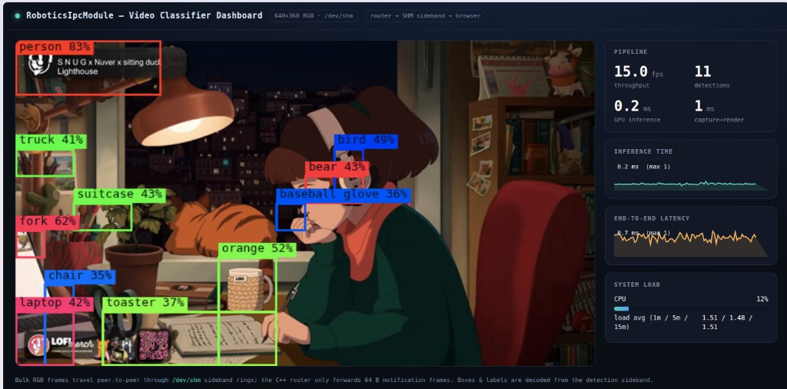

# Video Classifier Dashboard

> A four-process, three-language video pipeline wired together by the
> header-only **RoboticsIpcModule (RIM)** — and a single shared `topology.toml`.

Stream a **YouTube** video, classify it with **YOLO on CUDA**, overlay bounding
boxes, and watch the annotated result in a **live browser dashboard**. Python,
C++/CUDA, and Node.js processes all talk to each other through RIM's message
fabric without a single byte of glue code between them.

<p align="center">
  
</p>

**Why it's worth a look:**

- **Zero-copy by design** — megabytes of pixels move through shared memory; only
  64-byte notifications cross the router.
- **One config, four processes, three languages** — `topology.toml` is the single
  source of truth, consumed identically by C++, Python, and Node.
- **Runs with or without a GPU** — the build auto-detects CUDA and falls back to a
  pure-CPU detector, so the demo works on any Linux box.
- **No heavyweight deps** — no OpenCV, no ROS; `ffmpeg` decodes and the rest is
  hand-rolled.

### Contents

- **Getting started** —
  [Try it in 30 seconds](#try-it-in-30-seconds) ·
  [Choosing a video source](#choosing-a-video-source) ·
  [Frame rate & smooth playback](#frame-rate-resolution--smooth-playback)
- **Understand it** —
  [How it works](#how-it-works) ·
  [Requirements](#requirements)
- **Going further (GPU / TensorRT / Jetson)** —
  [Building manually](#building-manually) ·
  [Installing the TensorRT C++ SDK](#installing-the-tensorrt-c-sdk-x86-desktop) ·
  [Enabling real YOLO](#enabling-real-yolo-with-launchsh) ·
  [Running on Jetson Orin](#running-on-jetson-orin) ·
  [Detector backends](#detector-backends)
- **Reference** —
  [Troubleshooting](#troubleshooting) ·
  [Design notes](#design-notes) ·
  [Project layout](#project-layout)

---

## Try it in 30 seconds

```bash
cd examples/multi_process/video_classifier_dashboard
./launch.sh                                   # default lofi-girl live stream
# ...or bring your own source:
./launch.sh "https://www.youtube.com/watch?v=<id>"
```

Then open **<http://localhost:8080>**. Press **`Ctrl-C`** to stop everything —
the launcher tears down all `/dev/shm/rim_vcd_*` regions and `/tmp/rim_vcd_*.sock`
sockets on the way out.

`launch.sh` does all the setup for you: builds the C++ peers with CMake, creates a
Python venv for `yt-dlp`, runs `npm install` for the dashboard, then starts all
four processes and wires them through `topology.toml`.

> No GPU? It just works — the build drops to the CPU detector automatically.
> Want to force it? `VCD_FORCE_CPU=1 ./launch.sh`.

> **New here?** That's the whole demo — you're done. Everything below is optional:
> how it works, tuning the stream, and the advanced GPU / TensorRT / Jetson builds.
> Use the [Contents](#contents) to jump straight to what you need.

---

## Choosing a video source

The publisher resolves the stream with `yt-dlp`, so anything `yt-dlp` can play
works: YouTube live streams, normal videos, and most other sites it supports. A
**public, always-on live stream** is the nicest default (it never "ends").

**Check a URL before launching** — list its formats with the venv's `yt-dlp`:

```bash
.venv/bin/yt-dlp -F "https://www.youtube.com/watch?v=<id>"
```

What to look for in the output:

- **At least one row appears** → the video is reachable and playable. Example:
  ```
  ID EXT RESOLUTION FPS │   TBR PROTO │ VCODEC      ACODEC
  93 mp4 640x360     30 │  962k m3u8  │ avc1.4D401E mp4a.40.2
  95 mp4 1280x720    30 │ 2448k m3u8  │ avc1.4D401F mp4a.40.2
  ```
- A row at/below your `[video].yt_format` cap (default `best[height<=720]`) so the
  selector resolves. The frame is rescaled to `[video].width`×`height` anyway, so a
  360p–720p rendition is plenty.
- **Errors instead of a table** mean it won't work as a source:
  - `No video formats found!` → usually a stale `yt-dlp`; update it (see
    [Troubleshooting](#troubleshooting)).
  - `Sign in to confirm…`, `members-only`, `Video unavailable`, region blocks →
    the video needs authentication or isn't public; pick another, or pass cookies
    via `yt-dlp`'s `--cookies-from-browser`.

**Pin an exact rendition** if you like — set `[video].yt_format` in `topology.toml`
to a format ID from the table (e.g. `yt_format = "93"` for the 640×360 stream),
or keep the `best[height<=720]` selector.

> Heads-up: recent `yt-dlp` prints `No supported JavaScript runtime could be
> found … some formats may be missing`. Extraction still works, but installing
> **Deno** silences it and can expose more formats:
> `curl -fsSL https://deno.land/install.sh | sh` (then put `~/.deno/bin` on `PATH`).

### Frame rate, resolution & smooth playback

Resolution and frame rate are set in **`topology.toml`** under `[video]` — this is
the single source of truth all peers read (the publisher only falls back to these
values if the keys are missing):

```toml
[video]
width  = 640    # frame width  (publisher rescales the source to this)
height = 360    # frame height
fps    = 15     # frames per second pulled from the source
```

Lower `fps` / `width` / `height` for less CPU/GPU load and lower bandwidth; raise
them for a crisper feed. Remember the SHM slot is sized from these — `width × height
× 3` bytes per frame — so the peers stay byte-compatible automatically.

> **Why playback is smooth (the `-re` flag).** HLS streams arrive as multi-second
> segments. Without pacing, ffmpeg races through each freshly-downloaded segment
> *faster than real time*, then freezes while fetching the next one — a "chunky"
> sprint/stall cycle. The publisher passes ffmpeg **`-re`** (in
> `video_source/publisher.py`, `start_ffmpeg`) to emit frames at the input's native
> rate, which both smooths delivery and lets the next segment prefetch in the
> background. If a particular source is still choppy, lower `[video].fps` or try a
> source with shorter HLS segments.

---

## How it works

```
 ┌────────────┐   raw RGB        ┌─────────────┐  annotated RGB   ┌──────────────┐
 │ video_src  │  ───/dev/shm──▶  │ ml_inference│  ───/dev/shm──▶  │  dashboard   │
 │ (Python)   │                  │ (C++ + CUDA)│                  │  (Node.js)   │──▶ browser
 └─────┬──────┘                  └──────┬──────┘                  └──────▲───────┘
       │ topic 10 (UDS)                 │ topic 20 (UDS)                 │ (UDP)
       │   64 B notify                  │   64 B notify + stats          │
       └───────────────▶  ┌─────────────────────────┐  ◀──────────────-─┘
                          │  router (C++)            │
                          │  MixedRouterServer       │   forwards control frames only
                          │  UDS + UDP, one process  │
                          └─────────────────────────┘
```

**The key idea — and the RIM pattern this demonstrates: the pixels never touch
the router.** It forwards only 64-byte `RouterFrame` *notifications*. Each one
carries a sideband descriptor (`sideband_seq`, `sideband_len`, `sideband_idx`)
that points the consumer at the right slot in a shared-memory ring, declared as a
`[[peers.sideband]]` in the topology. That's the **control-plane / bulk-data
split** from RIM's ADR 0005 / ADR 0008 — tiny messages for coordination, shared
memory for the heavy payload.

`common/frame_shm.{hpp,py,js}` is the same lock-free, "newest-frame-wins" SHM ring
ported to all three languages, so they interoperate **byte-for-byte**.

### What each process demonstrates

| Process | Language | RIM feature exercised |
|---|---|---|
| `router/` | C++ | `topology_loader` + `MixedRouterServer` (UDS + UDP in one hop, Phase H) |
| `video_source/` | Python | the ctypes UDS bridge + a sideband SHM producer |
| `ml_inference/` | C++/CUDA | `IpcEndpoint<Uds>` peer, RouterFrame v2, **two** sideband regions per peer |
| `dashboard/` | Node.js | the UDP bridge + SHM sideband consumer → WebSocket |

---

## Requirements

External dependencies are allowed here (unlike RIM core):

| Category | Needs |
|---|---|
| **System** | `cmake` ≥ 3.20, a C++20 compiler, `ffmpeg`, `node` ≥ 18 **and `npm`** (separate packages on Debian/Ubuntu), `python3` ≥ 3.10 |
| **GPU** *(optional)* | CUDA toolkit. Without it the build uses the CPU detector so the pipeline still runs. |
| **Python** | `yt-dlp` (installed into a local venv by the launcher) |
| **Node** | `ws`, `smol-toml` (installed by `npm install`) |

---

## Going further

Everything from here is **optional**. The 30-second quickstart already gives you a
working pipeline with a GPU saliency (or CPU) detector. Read on only when you want
to customize the build, enable the real YOLOv8/TensorRT detector, deploy to a
Jetson, or troubleshoot.

## Building manually

`launch.sh` builds for you, but you can drive CMake directly — useful when you
want to enable TensorRT, force the CPU path, or target a specific GPU arch.

```bash
cd examples/multi_process/video_classifier_dashboard

# default build: auto-detects CUDA, falls back to the CPU detector if none
cmake -S . -B build -DRIM_DIR=../../../../RoboticsIpcModule -DCMAKE_BUILD_TYPE=Release
cmake --build build -j
# → build/rim_vcd_router  and  build/rim_vcd_ml
```

### Build flags

Supply these as `-D<FLAG>=<VALUE>` on the `cmake -S . -B build` configure line:

| Flag | Default | Effect |
|---|---|---|
| `-DRIM_DIR=<path>` | fetched from GitHub | Use a local RoboticsIpcModule checkout instead of `FetchContent`. Point it at your RIM repo (the sibling `../../../../RoboticsIpcModule` if you cloned both side by side). |
| `-DCMAKE_BUILD_TYPE=Release` | unset | Optimized build. Recommended for the GPU path. |
| `-DVCD_WITH_TENSORRT=ON` | `OFF` | Build the real **YOLOv8 TensorRT** detector (`yolo_trt.cu`). Requires CUDA **and** the TensorRT dev libraries (links `nvinfer` + `cudart`). Set `[ml].model_path` in `topology.toml` to a serialized `.engine`. |
| `-DVCD_FORCE_CPU=ON` | `OFF` | Skip CUDA entirely and build the CPU-only saliency detector, even on a machine that has a GPU. |
| `-DCMAKE_CUDA_ARCHITECTURES=<arch>` | `native` (CMake ≥ 3.24) | Target GPU compute capability. E.g. `86` for an RTX 3060, `87` for Jetson Orin, `75` for Turing. Set this if `native` detection fails or you cross-compile. |

> `launch.sh` exposes these flags as environment variables so you don't have to
> drive CMake by hand:
>
> | Env var | Maps to |
> |---|---|
> | `VCD_FORCE_CPU=1` | `-DVCD_FORCE_CPU=ON` |
> | `VCD_WITH_TENSORRT=1` | `-DVCD_WITH_TENSORRT=ON` |
> | `TENSORRT_DIR=<path>` | `-DTENSORRT_DIR=<path>` (tarball install; also added to the ML peer's `LD_LIBRARY_PATH` at runtime) |
> | `CMAKE_CUDA_ARCHITECTURES=<arch>` | `-DCMAKE_CUDA_ARCHITECTURES=<arch>` |

### Worked examples

```bash
# Real YOLOv8 + TensorRT on an RTX 3060 (compute capability 8.6)
cmake -S . -B build -DRIM_DIR=../../../../RoboticsIpcModule \
      -DCMAKE_BUILD_TYPE=Release \
      -DVCD_WITH_TENSORRT=ON \
      -DCMAKE_CUDA_ARCHITECTURES=86
cmake --build build -j

# GPU build without TensorRT (CUDA saliency kernel — no model needed)
cmake -S . -B build -DRIM_DIR=../../../../RoboticsIpcModule -DCMAKE_BUILD_TYPE=Release
cmake --build build -j

# CPU-only, force the fallback detector
cmake -S . -B build -DRIM_DIR=../../../../RoboticsIpcModule -DVCD_FORCE_CPU=ON
cmake --build build -j
```

If you change a flag, re-run the `cmake -S . -B build …` configure step (CMake
caches options in `build/CMakeCache.txt`); for a clean slate, `rm -rf build` first.

### Installing the TensorRT C++ SDK (x86 desktop)

The real YOLO backend links `nvinfer`, so you need the TensorRT **C++ SDK** —
headers (`NvInfer.h`) and dev libs. Get it from
[NVIDIA's TensorRT downloads](https://developer.nvidia.com/tensorrt) (free login),
matching your CUDA version.

> **The pip `tensorrt` wheels are not enough.** They ship the runtime
> `libnvinfer.so` only — no `NvInfer.h`, no dev symlink — so they can *build an
> engine* but cannot *compile* the C++ peer.

**Which package?** If your CUDA is apt-managed, use the **DEB**; if it's a hand
rolled/tarball/conda CUDA, use the **TAR**. Quick check:

```bash
dpkg -S "$(readlink -f "$(command -v nvcc)")" 2>/dev/null && echo "CUDA is apt-managed → use the deb" \
  || echo "CUDA is not apt-managed → use the tar"
```

**Option A — DEB local repo (recommended on apt-managed CUDA).** Installs into
`/usr`, so CMake finds it automatically (**no `TENSORRT_DIR`**) and its CUDA
dependencies resolve against your existing toolkit. Download the
*"TensorRT <ver> GA for Ubuntu <rel> and CUDA <range> DEB local repo Package"*
that matches your OS + CUDA, then:

```bash
sudo dpkg -i nv-tensorrt-local-repo-ubuntu2404-11.0.0-cuda-13.0_1.0-1_amd64.deb
sudo cp /var/nv-tensorrt-local-repo-ubuntu2404-11.0.0-cuda-13.0/*-keyring.gpg /usr/share/keyrings/
sudo apt-get update
sudo apt-get install -y libnvinfer-dev libnvinfer-headers-dev   # minimal C++ build deps
#   …or the full stack incl. trtexec/parsers:  sudo apt-get install -y tensorrt

# verify
ls /usr/include/x86_64-linux-gnu/NvInfer.h  /usr/lib/x86_64-linux-gnu/libnvinfer.so
```

- **cuDNN:** TensorRT 11's lean libs usually don't need it. If `apt` reports an
  unmet `libcudnn*` dependency, install just the `libnvinfer*` packages that do
  resolve, or add NVIDIA's cuDNN local repo too.
- **Version match:** the engine must match the SDK's TensorRT version. Compare
  `dpkg -l | grep nvinfer` against the `pip show tensorrt` that built your engine;
  if they differ, re-export the engine (with the deb you also get `trtexec`).

**Option B — TAR package (no apt changes / non-apt CUDA).** Extract anywhere and
point `TENSORRT_DIR` at it:

```bash
sudo tar -xzf TensorRT-<ver>.Linux.x86_64-gnu.cuda-<range>.tar.gz -C /opt
ls /opt/TensorRT-<ver>/include/NvInfer.h /opt/TensorRT-<ver>/lib/libnvinfer.so
```

### Enabling real YOLO with `launch.sh`

`[ml].model_path` in `topology.toml` already points at `yolov8n.engine`. With the
SDK installed, one command flips the pipeline from saliency to real detections:

```bash
# DEB install (apt-managed CUDA): TensorRT lives in /usr — no TENSORRT_DIR needed
VCD_WITH_TENSORRT=1 CMAKE_CUDA_ARCHITECTURES=86 ./launch.sh

# TAR install alternative: point at the extracted SDK
TENSORRT_DIR=/opt/TensorRT-<ver> VCD_WITH_TENSORRT=1 CMAKE_CUDA_ARCHITECTURES=86 ./launch.sh
```

`launch.sh` prints its resolved build config (`build config: TensorRT=1 …`) and
warns on mistyped `VCD_*` knobs, and the ML peer logs the backend it actually
chose — look for `[ml] backend=cuda-yolov8-trt …` (not `cuda-saliency`). If you
see `model set but built without TensorRT`, the flag didn't take; re-run after
`rm -rf build`.

---

## Running on Jetson Orin

This is the **easy** platform for the TensorRT path: JetPack/L4T ships the full
TensorRT **C++ SDK** system-wide (`/usr/include/aarch64-linux-gnu/NvInfer.h`,
`/usr/lib/aarch64-linux-gnu/libnvinfer.so`), so CMake finds it with **no
`TENSORRT_DIR`** needed.

```bash
# 1. Build the engine ON the Jetson (engines are NOT portable — see caveat).
yolo export model=yolov8n.pt format=engine half=True imgsz=640
#    …or with JetPack's bundled trtexec, straight from an ONNX:
/usr/src/tensorrt/bin/trtexec --onnx=yolov8n.onnx --saveEngine=yolov8n.engine --fp16

# 2. Build + run with TensorRT, targeting Orin's Ampere GPU (sm_87).
VCD_WITH_TENSORRT=1 CMAKE_CUDA_ARCHITECTURES=87 ./launch.sh

# 3. (Recommended) unlock max clocks before measuring throughput.
sudo nvpmodel -m 0 && sudo jetson_clocks
```

**Critical caveat — rebuild the engine on the device.** A `.engine` is tied to
both the **TensorRT version** and the **GPU architecture** it was built on. An
engine built on an x86 desktop (e.g. TensorRT 11 / sm_86) will **not** deserialize
on an Orin; build it on the Jetson with that JetPack's TensorRT. Confirm the
version with `dpkg -l | grep nvinfer`.

**Tuning for Orin:**

| Lever | How | Why |
|---|---|---|
| FP16 | `--fp16` (trtexec) or `half=True` | ~2× over FP32 on Orin's tensor cores, negligible YOLOv8 accuracy loss |
| DLA | `trtexec --useDLACore=0 --allowGPUFallback` | offloads inference to a DLA engine, freeing the GPU |
| Clocks | `sudo nvpmodel -m 0 && sudo jetson_clocks` | default power modes throttle hard |
| HW decode | swap `ffmpeg` software decode for GStreamer `nvv4l2decoder` (NVDEC) | the publisher currently does CPU decode; Orin has dedicated NVDEC |

> The latest L4T for **Orin** is the **JetPack 6.x** line (Ubuntu 22.04,
> TensorRT 10.x / CUDA 12.6). For a production pipeline you'd typically reach for
> **DeepStream** (GStreamer + the `nvinfer` plugin) to keep frames in NVMM buffers
> end-to-end — but this example's C++ TensorRT backend is the simplest way to get
> real, hardware-accelerated YOLO running on the board.

---

## Detector backends

The ML peer picks a backend at build/run time:

1. **`cuda-yolov8-trt`** — real YOLOv8 via TensorRT. Build with
   `-DVCD_WITH_TENSORRT=ON` (see [Building manually](#building-manually)) and set
   `[ml].model_path` in `topology.toml` to a serialized engine. Export one with
   Ultralytics:
   ```bash
   pip install ultralytics
   yolo export model=yolov8n.pt format=engine half=True imgsz=640
   # → yolov8n.engine ; put its path in topology.toml [ml].model_path
   ```
   (If the FP16 export fails, see [Troubleshooting](#troubleshooting) below.)
2. **`cuda-saliency`** — no model needed; a CUDA edge-energy kernel produces boxes,
   so the whole GPU path runs out of the box.
3. **`cpu-saliency`** — the same detector on the CPU when no GPU is present.

Boxes are drawn into the frame by the C++ peer (`overlay.hpp`); the browser adds
crisp class/score labels from the detection sideband.

---

## Troubleshooting

| Symptom | Cause | Fix |
|---|---|---|
| `BuilderFlag … has no attribute 'FP16'` during `yolo export … format=engine` | **TensorRT 10+/11 removed the `FP16` builder flag** (precision is now set via strongly-typed networks). The Ultralytics version installed still calls the old API when `half=True`. | Export without FP16: `yolo export model=yolov8n.pt format=engine imgsz=640` (FP32 engine). See the [precision options](#tensorrt-fp16-export-fails) below for FP16 alternatives. |
| `Command 'ffmpeg' not found` | `ffmpeg` isn't installed. | `sudo apt install ffmpeg` |
| `npm: command not found` (node works fine) | On Debian/Ubuntu `npm` ships in a **separate package** from `node`. | `sudo apt install npm` |
| `yt-dlp … No video formats found!` / `This live stream … not available` | The video source's `yt-dlp` is **out of date** (YouTube changes often), or the stream ended / is restricted. | `.venv/bin/pip install -U yt-dlp` (or `… -U --pre 'yt-dlp[default]'` for nightly); or pick another public URL: `./launch.sh <youtube_url>`. The launcher now auto-updates yt-dlp each run when online. |
| Playback sprints faster-than-realtime, then freezes, repeatedly | HLS segment pacing — ffmpeg bursts through a segment, then stalls fetching the next. | The publisher already passes ffmpeg `-re` to pace at native rate (see [Frame rate, resolution & smooth playback](#frame-rate-resolution--smooth-playback)). If still choppy, lower `[video].fps` or try a shorter-segment source. |
| Build prints `no CUDA compiler found — using CPU fallback` | No CUDA toolkit / `nvcc` not on `PATH`. | Expected on CPU-only machines. Install the CUDA toolkit and ensure `nvcc` is on `PATH` for the GPU path, or accept the CPU detector. |
| Engine fails to deserialize at runtime (TensorRT version error) | The `.engine` was built with a **different TensorRT version or GPU architecture** than the machine running it (e.g. an x86 engine on a Jetson). Engines are not portable across either. | Rebuild the engine **on the target machine** with the same TensorRT version you build/link `rim_vcd_ml` against. On Jetson use the device's `trtexec` (see [Running on Jetson Orin](#running-on-jetson-orin)). |
| `deserializeCudaEngine: … header.magicTag == kEXPECTED_MAGIC_TAG failed` (e.g. `1827 != 1953657958`) | The `.engine` from `yolo export format=engine` has an **Ultralytics metadata header** (`[int32 len][JSON]`) prepended before the real engine; the wrong-magic value is that header's length. | Handled automatically — the loader (`yolo_trt.cu`) detects and skips the JSON header. If you see this, your build predates that fix (`rm -rf build` and rebuild), or the file isn't a TRT engine. `trtexec`-built engines have no header. |
| `cannot open engine yolov8n.engine` at ML startup | `VCD_WITH_TENSORRT=ON` build but the `.engine` named in `topology.toml` doesn't exist in the launch directory. | Export/build the engine first (see [Detector backends](#detector-backends)), or clear `[ml].model_path` to fall back to saliency. |
| Dashboard won't bind / port already in use | Something else is on `8080`. | `VCD_HTTP_PORT=9090 ./launch.sh` and open that port instead. |
| Pipeline stalls after a crash; nothing updates | Stale shared-memory regions or sockets from a previous run. | `rm -f /dev/shm/rim_vcd_* /tmp/rim_vcd_*.sock` then relaunch. (The launcher normally cleans these up on exit.) |

### TensorRT FP16 export fails

The most common snag. Newer TensorRT (10/11) dropped the explicit `FP16`/`INT8`
builder flags, so Ultralytics' `half=True` export path raises
`AttributeError: … BuilderFlag … has no attribute 'FP16'`. Your options, easiest
first:

1. **Export FP32** — drop `half=True`. Works today, costs some throughput:
   ```bash
   yolo export model=yolov8n.pt format=engine imgsz=640
   ```
2. **Use the ONNX you already have** — the same `yolo export … format=onnx` (or the
   ONNX emitted during the engine export) runs on the GPU via `onnxruntime-gpu`,
   including a TensorRT execution provider that gives near-engine speed and FP16
   without the broken builder-flag path.
3. **Match Ultralytics to your TensorRT** — use an Ultralytics release that supports
   your installed TensorRT's strongly-typed API (check their changelog), then retry
   with `half=True`.

For YOLOv8n on a desktop GPU, the FP32-vs-FP16 difference is usually absorbed by
the video framerate ceiling — start with option 1 to get running, optimize later.

---

## Design notes

**No OpenCV.** Decoding is done by `ffmpeg` (raw `rgb24` frames piped into Python);
all pixel work (overlay, RGB→RGBA) is hand-rolled. The only image library anywhere
in the stack is the GPU detector itself.

---

## Project layout

```
topology.toml            one config consumed by all four processes
launch.sh                build + run + teardown
common/                  cross-language SHM ring + wire payload definitions
router/router_main.cpp   process 0 — C++ router
video_source/            process 1 — Python video publisher
ml_inference/            process 2 — C++/CUDA YOLO/saliency detector
dashboard/               process 3 — Node.js server + browser UI
```
